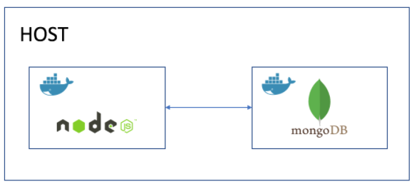

# Docker Compose 

## What is docker compose?
* Compose is a tool for defining and running multi-container Docker applications. With Compose, you use a YAML file to configure your application's services.

## Install docker compose
* For Windows, it is already available as Docker Desktop available
 
## create a .yml with docker-compose to launch our app with mongodb


`nano docker-compose.yml`
```
version: '3'

services:
  # start the db image and map to port 27017
  db:
    image: mongo
    restart: always
    ports: [27017:27017]
    volumes:
    - data-volume:/data/db
    - ./mongod.conf:/etc/mongod.conf

  web:
    # start up the web app image and map to localhost
    build: ./app
    restart: always
    ports: [80:3000]
    # set variable for a db port
    environment:
      - DB_HOST=mongodb://db:27017/posts
    depends_on:
      - db
    volumes:
    - ./app:/src/app
    # could also use links
    # can run the seeds here if CMD doesn't work
     
    
volumes:
  data-volume:
```
## docker-compose up or docker-compose up -d
```
docker-compose up -d --build
# to seed the db
winpty docker exec -it $(docker ps -l --format "{{.ID}}") node seeds/seed.js
# to check the volume 
docker inspect -f '{{ .Mounts }}' <cotainerid>

```

* Note: we can see "Your app is ready and listening on port 3000"

 

## ensure all three pages work including /posts
* All the below 3 pages working
* http://localhost/
* http://localhost/posts/
* http://localhost/fibonacci/3
  
### create a volume to make data persistent
```
# Include the below in the docker-compose.yml 
  db: 
    volumes:
    - data-volume:/data/db
    - ./mongod.conf:/etc/mongod.conf
  web:
    volumes:
    - ./app:/src/app
    # could also use links
    # can run the seeds here if CMD doesn't work
     
    
volumes:
  data-volume:
```
### check the volume 
`docker inspect -f '{{ .Mounts }}' <cotainerid>`

